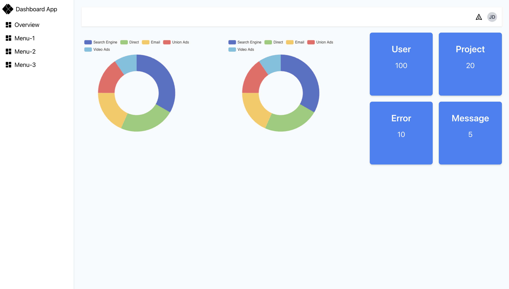
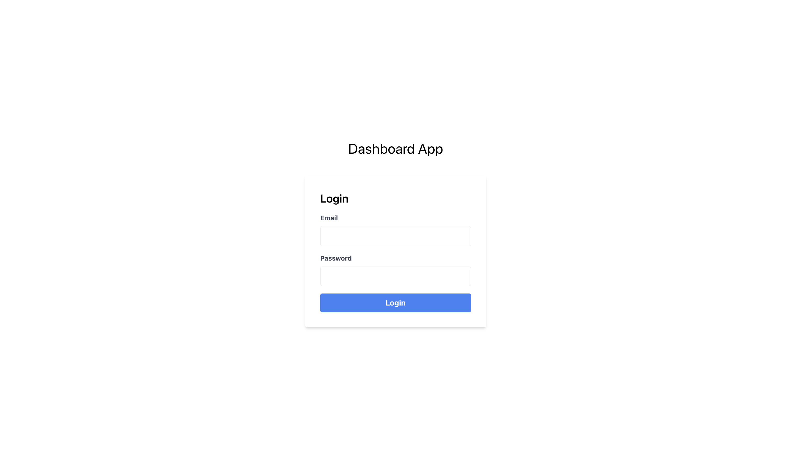

# Dashboard App

A dashboard app built with TypeScript, Vite, React, and Tailwind CSS.

## Preview

#### Dashboard Page



#### Login Page



## Table of Contents

- [Getting Started](#getting-started)
  - [Prerequisites](#prerequisites)
  - [Installation](#installation)
- [Usage](#usage)
- [Development](#development)
- [Deployment](#deployment)
- [Contributing](#contributing)
- [License](#license)

## Getting Started

### Prerequisites

Before you begin, ensure you have met the following requirements:

- Node.js and npm installed on your local machine.
- Yarn (optional but recommended for package management).

### Installation

To get this project up and running, follow these steps:

1. Clone the repository:

   ```bash
   git clone https://github.com/oleglukasevici/dashboard-app.git
   ```

2. Navigate to the project directory:

   ```bash
   cd dashboard
   ```

3. Install dependencies:

   ```bash
   yarn install
   # or
   npm install
   ```

## Usage

To start the development server and run the app locally, use the following command:

```bash
yarn dev
# or
npm run dev
```

This will start the development server, and you can access the app in your web browser at `http://localhost:3000`.

## Development

To contribute to this project, follow these steps:

1. Create a new branch:

   ```bash
   git checkout -b feature/your-feature-name
   ```

2. Make your changes and commit them:

   ```bash
   git commit -m "Add your changes here"
   ```

3. Push to the branch:

   ```bash
   git push origin feature/your-feature-name
   ```

4. Create a pull request on GitHub.

## Deployment

To deploy the app for production, you can use the following command:

```bash
yarn build
# or
npm run build
```

This will create a production-ready build of your app in the `dist` directory. You can then host this directory on a web server of your choice.

## Contributing

Contributions are welcome! Please read the [Contribution Guidelines](CONTRIBUTING.md) for more details on how to contribute to this project.

## License

This project is licensed under the MIT License - see the [LICENSE](LICENSE) file for details.
